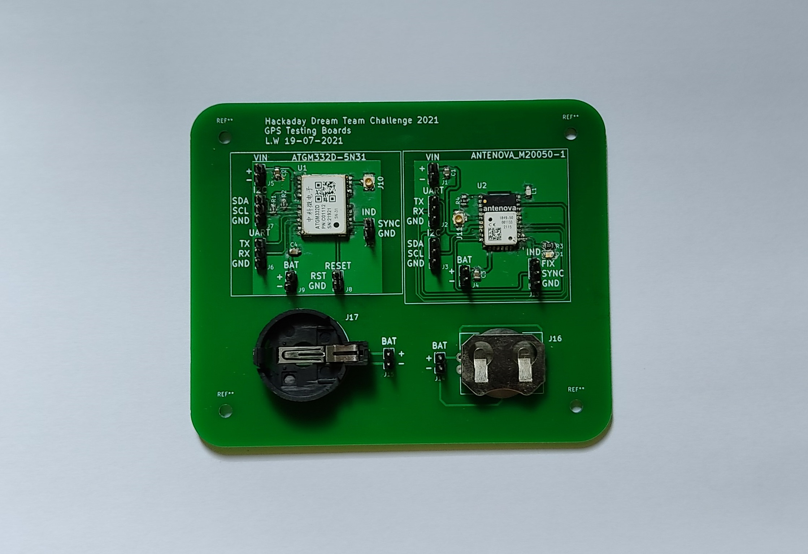
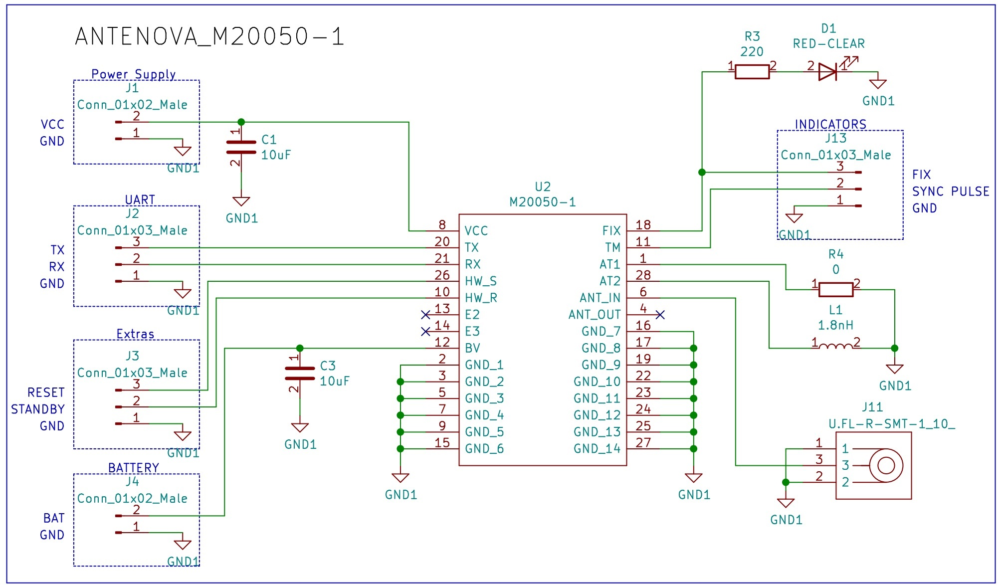
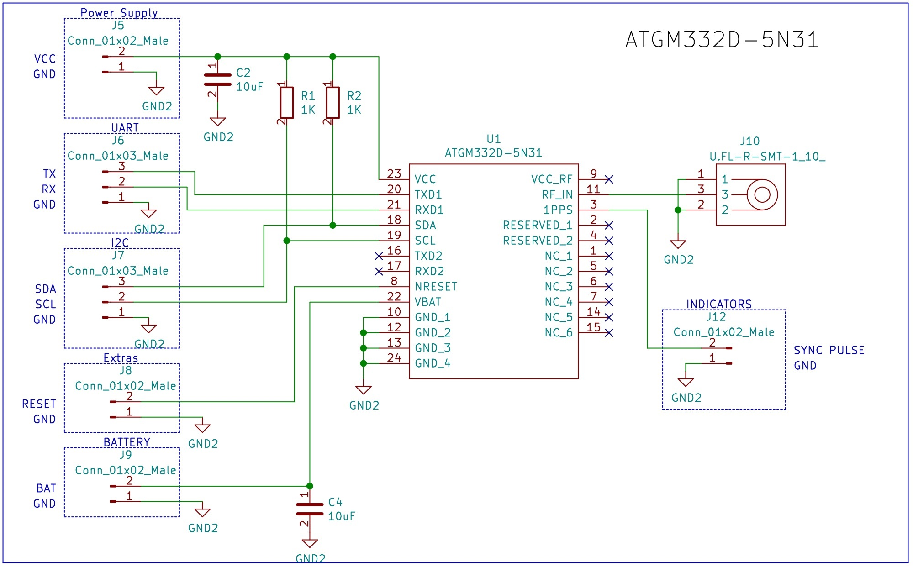
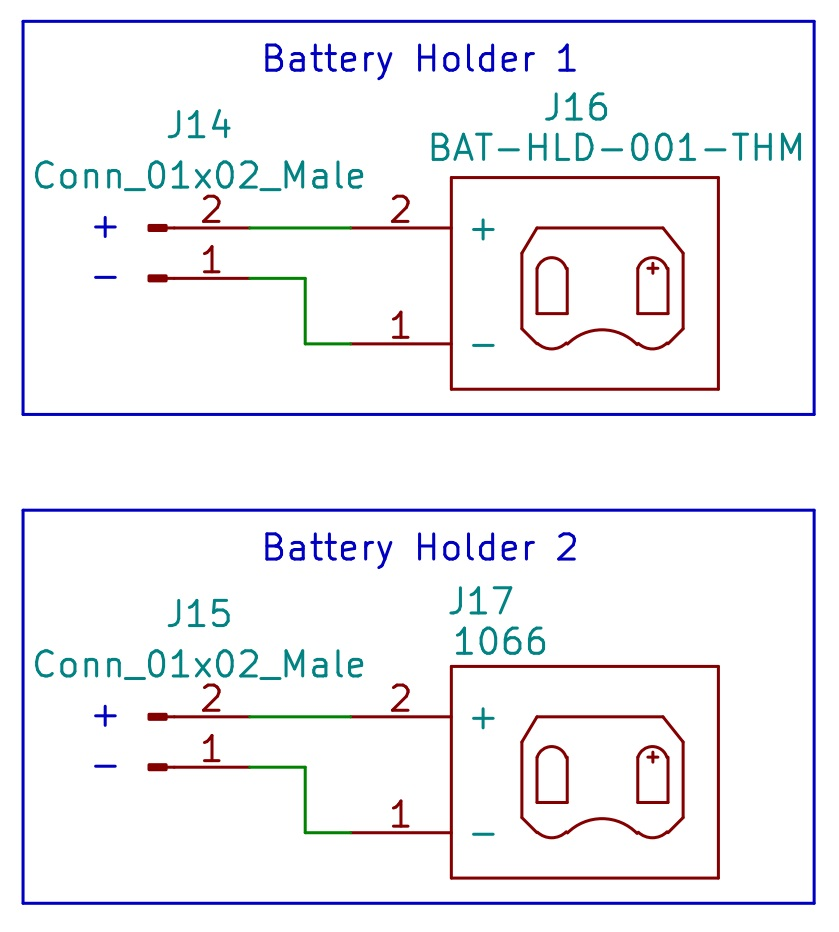
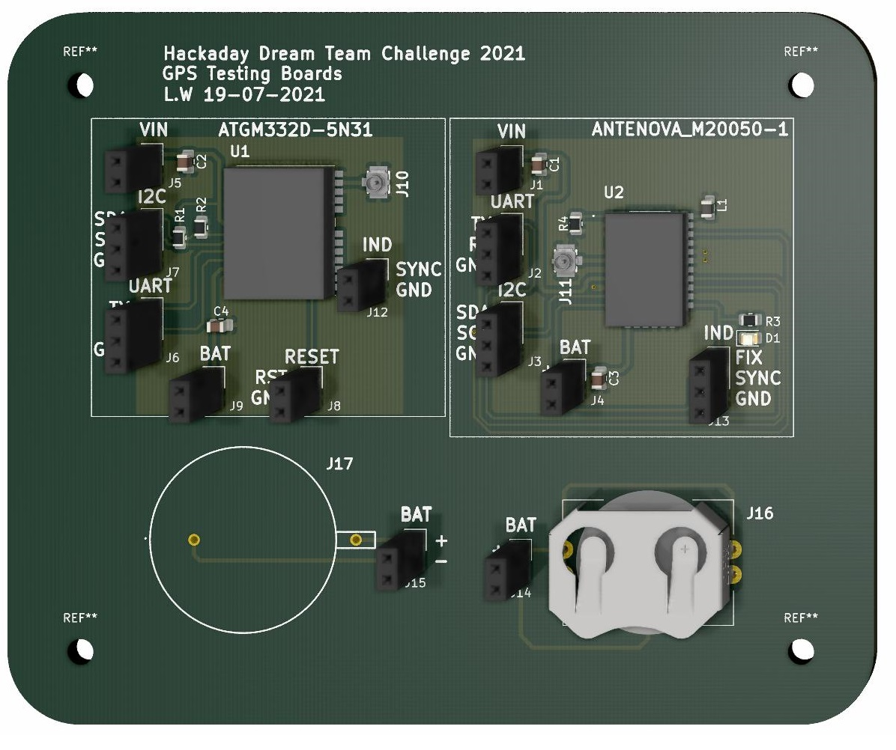
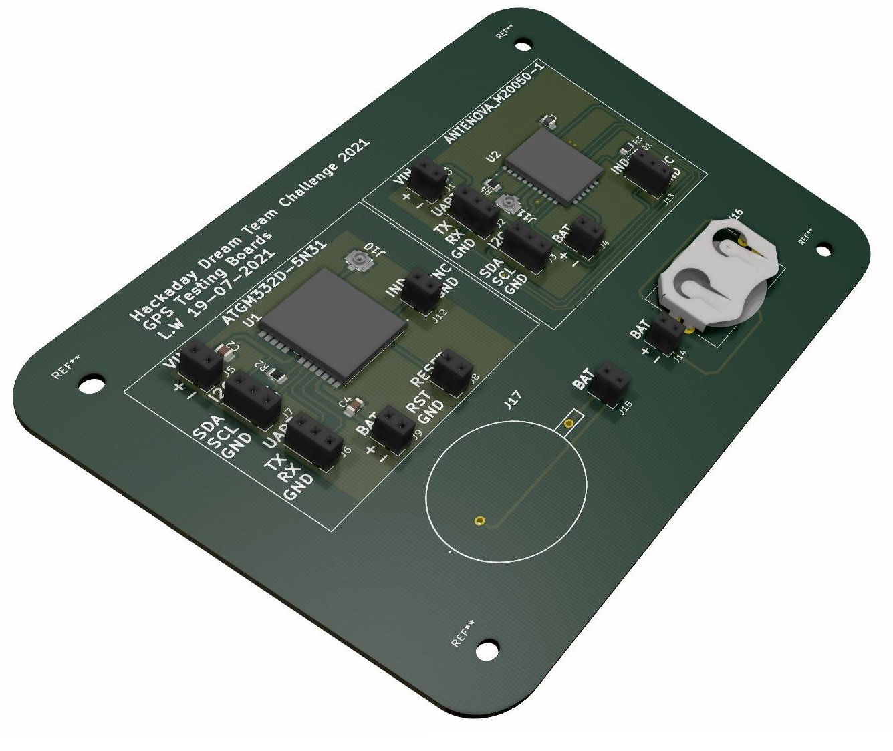

# GPS Development Board - ANTENOVA M20050-1 and ATGM332D-5N31 #

  

This repository contains the design of a development board for the [ANTENOVA M20050-1](https://www.digikey.com/en/products/detail/antenova/M20050-1/7931495) and the [ATGM332D-5N31](https://lcsc.com/product-detail/Satellite-Positioning-Modules_ZHONGKEWEI-ATGM332D-5N31_C128659.html). The PCB was designed using KiCad.

## Schematic for the ANTENOVA M20050-1 ##

  

## Schematic for the ATGM332D-5N31 ##

  

## Additional Coin Battery Holders ##

  

## Bill of Materials ##

| Reference | Quantity |
| ------------- | ------------- |
| [10 µF ±10% 6.3V Ceramic Capacitor X5R 0805 (2012 Metric)](https://www.digikey.com/en/products/detail/samsung-electro-mechanics/CL21A106KQCLNNC/3888062)  | 4 |
| [Red 630nm LED Indication - Discrete 1.9V 0805 (2012 Metric)](https://www.digikey.com/en/products/detail/w%C3%BCrth-elektronik/150080SS75000/4489921)  | 1 |
| [U.FL (UMCC) Connector Receptacle, Male Pin 50Ohm Surface Mount Solder](https://www.digikey.com/en/products/detail/hirose-electric-co-ltd/U-FL-R-SMT-1-10/2391570) | 2 |
| [Battery Retainer Coin, 20.0mm 1 Cell PC Pin](https://www.digikey.com/en/products/detail/linx-technologies-inc/BAT-HLD-001-THM/3044009) | 1 |
| [Battery Holder (Open) Coin, 20.0mm 1 Cell PC Pin](https://www.digikey.com/en/products/detail/keystone-electronics/1066/303562) | 1 |
| [Unshielded Multilayer Inductor 100mOhm Max 0805 (2012 Metric)](https://www.digikey.com/en/products/detail/abracon-llc/AIMC-0805-1N8S-T/2662915) | 1 |
| [1K ±1% 0.125W, 1/8W Chip Resistor 0805 (2012 Metric) Automotive AEC-Q200 Thick Film](https://www.digikey.com/en/products/detail/panasonic-electronic-components/ERJ-6ENF1001V/111281) | 2 |
| [220 Ohms ±5% 0.125W, 1/8W Chip Resistor 0805 (2012 Metric) Moisture Resistant Thick Film](https://www.digikey.com/en/products/detail/yageo/RC0805JR-07220RL/728283) | 1 |
| [0 Ohms Jumper 0.125W, 1/8W Chip Resistor 0805 (2012 Metric) Moisture Resistant Thick Film](https://www.digikey.com/en/products/detail/yageo/RC0805JR-070RL/728216) | 1 |
| [ATGM332D-5N31 GNSS Series GPS+BDS 12.2x16x2.4mm Satellite Positioning Modules ROHS](https://lcsc.com/product-detail/Satellite-Positioning-Modules_ZHONGKEWEI-ATGM332D-5N31_C128659.html) | 1 |
| [Antenova M20050-1 series RF Receiver GPS 1.575GHz -165dBm - On-Board, Trace Module](https://www.digikey.com/en/products/detail/antenova/M20050-1/7931495) | 1 |
| [Conn Header 40POS 2.54](https://www.digikey.com/en/products/detail/3m/2340-6111TG/1237275) | 1 |

## 3D Model ##

  

  

